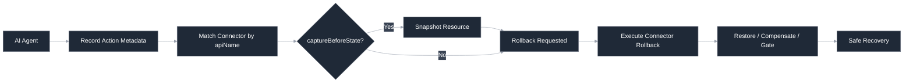

  

  
<strong>Wrap your AI agents. Undo anything.</strong>

  
[![Docs](https://img.shields.io/badge/Docs-agentrein.com-45bb00?style=for-the-badge&logo=data:image/svg+xml;base64,PHN2ZyB4bWxucz0iaHR0cDovL3d3dy53My5vcmcvMjAwMC9zdmciIHdpZHRoPSIyMDAiIGhlaWdodD0iMjAwIiB2aWV3Qm94PSIwIDAgMjAwIDIwMCI+PHBhdGggZmlsbC1ydWxlPSJldmVub2RkIiBmaWxsPSIjZmZmZmZmIiBkPSJNMjAwIDEwMCBBMTAwIDEwMCAwIDEgMCAwIDEwMCBBMTAwIDEwMCAwIDEgMCAyMDAgMTAwIFogTTUwLjQ4IDUwLjI3IGMwIDAuMDggNS41NiA1LjY5IDEyLjM1IDEyLjQ4IGwxMi4zNyAxMi4zNyBsLTEyLjQ1IDAgbC0xMi40MyAwIGwwIDM3LjM2IGwwIDM3LjM2IGwxMi40OCAwIGwxMi40OCAwIGwwIC0xOS43MyBsMCAtMTkuNzQgbDE5Ljc0IDE5Ljc0IGwxOS43MyAxOS43MyBsMTcuNTUgMCBjOS42NCAwIDE3LjU0IC0wLjA1IDE3LjU0IC0wLjEzIGMwIC0wLjA3IC01LjU0IC01LjY2IC0xMi4zMiAtMTIuNDMgYy02Ljc4IC02Ljc4IC0xMi4zMiAtMTIuMzIgLTEyLjMyIC0xMi4zNCBjMCAwIDAuNzYgLTAuMDcgMS42NyAtMC4xMiBjMi4wMiAtMC4xMiA0Ljk3IC0wLjc0IDYuOTEgLTEuNDkgYzMuNTYgLTEuMzYgNS45OCAtMi45NSA4Ljg1IC01LjgyIGMzIC0zLjAyIDQuODggLTYgNi4wNiAtOS42OCBjMS4yOSAtMy45OCAxLjM0IC00Ljk1IDEuMjYgLTIxLjcgYy0wLjA3IC0xNS40MSAtMC4wMyAtMTQuOTMgLTEuMSAtMTguMzkgYy0yLjk0IC05LjUgLTExLjI4IC0xNi4zNCAtMjEuMjUgLTE3LjQzIGMtMS44MyAtMC4yIC03Ny4xMSAtMC4yNCAtNzcuMTEgLTAuMDUgbTc0LjU2IDQ5LjY1IGMwIDEzLjYzIC0wLjAxIDI0LjggLTAuMDUgMjQuOCBjLTAuMDEgMCAtMTEuMiAtMTEuMTYgLTI0LjgzIC0yNC44IGwtMjQuOCAtMjQuOCBsMjQuODQgMCBsMjQuODMgMCBsMCAyNC44Ii8+PC9zdmc+Cg==&logoColor=white)](https://www.agentrein.com/docs)

---

## What is AgentRein?

AgentRein is a rollback and safety layer for AI agents that take actions in production tools. It records agent actions, captures before-state where needed, and executes service-specific rollback logic when an action must be undone. Learn more at [AgentRein](https://agentrein.com).

Whether you're running agents against Stripe, Slack, GitHub, or any other service. AgentRein ensures every action is safe, observable, and reversible.

## How it Works

## Repositories

This GitHub organization contains repos officially maintained by [AgentRein](https://www.agentrein.com).

- Connectors and plugin interfaces live in the [`agentrein-connectors`](https://github.com/agentrein/agentrein-connectors) repo
- The TypeScript SDK lives in the [`sdk`](https://github.com/agentrein/sdk) repo
- Documentation for all products is in the [`docs`](https://github.com/agentrein/docs) repo

## Contributing
We welcome contributions to our open-source connectors. See [`agentrein-connectors`](https://github.com/agentrein/agentrein-connectors) to get started.