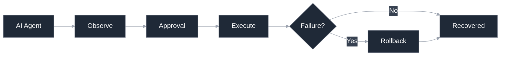

<div align="center">


<br />

# Wrap your AI agents. Undo anything.

### The rollback layer for AI agents.

Ship autonomous AI agents with confidence. AgentRein records every action, adds approval gates, captures audit logs, and automatically rolls back production changes when something goes wrong.

<br />

[](https://www.agentrein.com/docs)
[](https://www.agentrein.com)
[](https://www.npmjs.com/package/agentrein)
[](https://discord.gg/EWkfguCV)

</div>

---

# Why AgentRein?

AI agents are becoming autonomous.

Production systems are not.

A single incorrect action can:

- Generate the wrong invoice.
- Send an email to the wrong customer.
- Delete production data.
- Open the wrong GitHub issue.
- Modify the wrong Notion page.

Most AI infrastructure helps agents make decisions.

**AgentRein helps recover when those decisions are wrong.**

---

# What AgentRein Does

AgentRein sits between your AI agent and production services.

It provides four safety layers:

- ↶ **Automatic Rollback** — Reverse production actions automatically.
- ✓ **Approval Gates** — Pause high-risk actions for human approval.
- ◎ **Audit Trail** — Record every action and decision.
- ◇ **Intent Verification** — Detect goal drift before execution.

Wrap your existing SDKs.

Keep your existing architecture.

No rewrites.

---

# Quickstart

### 1. Install

```bash
npm install agentrein
```

### 2. Wrap your SDK

```ts
const session = await agentrein.newSession({
  agentId: "billing-agent",
  intent: "Create customer invoice"
})

const stripe = agentrein.wrap(stripeClient, session)
```

### 3. Ship safely

```ts
await stripe.invoices.create(...)
```

---

# What happens on failure?

```text
Agent executes

      │

      ▼

Stripe invoice created
Slack message sent
GitHub issue opened

      │

      ▼

Unexpected behavior detected

      │

      ▼

Rollback initiated

      │

      ▼

Invoice cancelled
Slack reverted
GitHub issue closed

      │

      ▼

System recovered
```

---

# How it works


```mermaid
%%{init: {
  "theme": "base",
  "themeVariables": {
    "primaryColor": "#1f2937",
    "primaryTextColor": "#ffffff",
    "primaryBorderColor": "#6b7280",
    "lineColor": "#9ca3af",
    "secondaryColor": "#374151",
    "tertiaryColor": "#111827"
  }
}}%%

flowchart LR

A[AI Agent]

B[Observe]

C[Approval]

D[Execute]

E{Failure?}

F[Rollback]

G[Recovered]

A --> B --> C --> D --> E

E -->|No| G

E -->|Yes| F --> G
```

---

# Ecosystem

| Repository | Purpose |
|------------|---------|
| **sdk** | TypeScript SDK |
| **agentrein-connectors** | Rollback connectors for production services |
| **docs** | Documentation |
| **examples** *(coming soon)* | End-to-end examples |

---

# Supported integrations

- Stripe
- Slack
- GitHub
- Notion
- HubSpot
- Salesforce
- Gmail
- Google Drive
- Google Sheets

…and more through open-source connectors.

---

# Documentation

- 📖 Documentation → https://agentrein.com/docs
- ⚡ Quickstart → https://agentrein.com/docs
- 🔌 Connectors → https://github.com/agentrein/agentrein-connectors
- 💬 Discord → https://discord.gg/EWkfguCV

---

# Built in the open.

AgentRein is open source.

We welcome:

- New connectors
- Bug fixes
- Documentation improvements
- Examples
- Ideas

If you're building AI infrastructure, we'd love to collaborate.

---

<div align="center">

### Let them act.

# Sleep at night.

</div>
